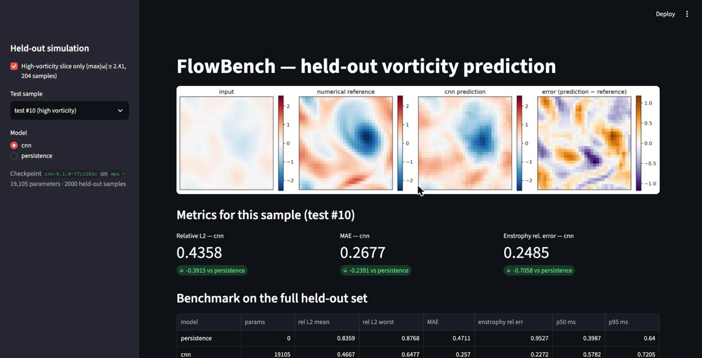
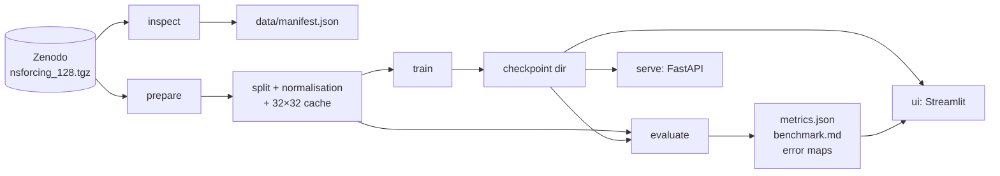

# FlowBench

[](https://github.com/aamamnun/flowbench/actions/workflows/ci.yml)
[](pyproject.toml)
[](LICENSE)
[](pyproject.toml)
[](pyproject.toml)

FlowBench predicts a 2D fluid's future vorticity field from a single input field and
shows, side by side, the input, the numerical reference, the neural prediction and the
error map. It is a reproducible scientific-ML pipeline (`inspect → prepare → train →
evaluate → serve`) driven by one YAML file, with a published persistence-vs-CNN
benchmark, measured single-sample latency, a FastAPI endpoint and a Streamlit viewer.
It runs on a laptop (Apple Silicon `mps`, or CPU) with no external services.



The same four fields as optional interactive 3D surfaces (height = vorticity):
[docs/assets/ui_3d.png](docs/assets/ui_3d.png).

## Benchmark

Persistence (output = input) versus a 4-layer, 32-channel residual CNN on the 2 000
held-out test pairs. Every number below is written by `flowbench evaluate` from
`artifacts/default/report/metrics.json`; nothing is typed by hand.

<!-- BEGIN GENERATED: flowbench evaluate -->

_Generated 2026-09-13T05:34:12+00:00 by `flowbench evaluate` on run `default` (flowbench 0.1.0, git `77c1383c`, device `mps`)._

| Model | Params | Rel. L2 mean | Rel. L2 worst | MAE (field units) | Enstrophy rel. err. mean | Enstrophy rel. err. worst | p50 ms | p95 ms |
| --- | ---: | ---: | ---: | ---: | ---: | ---: | ---: | ---: |
| persistence | 0 | 0.8359 | 0.8768 | 0.4711 | 0.9527 | 0.9559 | 0.40 | 0.64 |
| cnn | 19,105 | 0.4667 | 0.6477 | 0.257 | 0.2272 | 0.5425 | 0.58 | 0.72 |

**High-vorticity slice** (reference max|ω| ≥ 2.406, the 90% quantile over 10000 train+validation reference fields; 204 of 2000 test samples):

| Model | Rel. L2 mean | Rel. L2 worst | MAE | Enstrophy rel. err. mean |
| --- | ---: | ---: | ---: | ---: |
| persistence | 0.8348 | 0.8596 | 0.5411 | 0.9529 |
| cnn | 0.4681 | 0.62 | 0.3027 | 0.1697 |

**Setup.** 2000 held-out test pairs at 32×32; relative L2 uses an epsilon floor of 1e-08 on the reference norm (floored samples: persistence 0, cnn 0). Enstrophy is 0.5·mean(ω²) over the grid because the domain size is unknown. Latency is the batch-one preprocess+inference+postprocess path after 20 warm-up calls, over 200 timed calls on `mps`; HTTP overhead is not included.

<!-- END GENERATED -->

Machine: MacBook Pro, Apple M5, 24 GB, macOS 26.6, torch 2.14.0. The CNN was trained
for 50 epochs (about 2.5 minutes on `mps`); the checkpoint was selected by validation
MSE. Methodology, including how the slice threshold and the epsilon floor are applied,
is in [docs/benchmark.md](docs/benchmark.md). Error maps for the first test samples are
written to `artifacts/default/report/error_map_*.png`.

## Quickstart

Requires [uv](https://docs.astral.sh/uv/) and about 4 GB of disk for the archive and
the extracted tensors. The first `inspect` downloads a 1.45 GB archive from Zenodo.

```bash
uv sync --frozen
uv run flowbench inspect  --config configs/default.yaml   # download once, write data/manifest.json
uv run flowbench prepare  --config configs/default.yaml   # split by simulation ID, fit normalisation
uv run flowbench train    --config configs/default.yaml   # ~2.5 min on mps, ~19k parameters
uv run flowbench evaluate --config configs/default.yaml   # writes artifacts/default/report + this table
```

Then, in two terminals:

```bash
uv run flowbench serve --config configs/default.yaml   # FastAPI on http://127.0.0.1:8000
uv run flowbench ui    --config configs/default.yaml   # Streamlit on http://localhost:8501
```

```bash
curl -s http://127.0.0.1:8000/health
curl -s http://127.0.0.1:8000/version
curl -s -X POST http://127.0.0.1:8000/predict \
  -H 'content-type: application/json' \
  -d "{\"field\": $(python3 -c 'print([[0.0]*32]*32)')}" | head -c 200
```

`POST /predict` takes `field` (32×32 nested list) or `field_b64` (little-endian float32
bytes, row-major) and returns `prediction`, `shape`, `model_version`, `device` and
`latency_ms`. Malformed input gets a structured `{"error": {...}}` body with status 422.
The viewer shows the four 2D panels by default; a sidebar toggle adds interactive
Plotly 3D surfaces (height = vorticity) for the same four fields.
`make smoke` runs the whole pipeline on `configs/smoke.yaml` in about 20 seconds.

## Architecture



One package, one CLI, one config schema. Modules talk through small typed objects
(`FieldPairs`, `Split`, `NormalizationStats`, `Predictor`, `LoadedCheckpoint`) and
files under `data/` and `artifacts/`. Only `serving/` and `ui/` import FastAPI or
Streamlit; `evaluation/metrics.py` is pure Torch. Module map, checkpoint contract and
the list of design decisions with rejected alternatives:
[docs/architecture.md](docs/architecture.md).

## Data provenance and unknowns

- **Source**: Zenodo record [12825163](https://zenodo.org/records/12825163), "Navier-Stokes
  Dataset" (NeuralOperator Team, CC-BY-4.0): 10 000 train and 2 000 test input/output pairs
  of vorticity at 128×128, described as the time evolution of 2D incompressible
  Navier–Stokes flow at Reynolds number 500, generated at 1024×1024 by a classical solver.
- **Loader**: `neuralop.data.datasets.navier_stokes.NavierStokesDataset` (neuraloperator
  2.0.0), used for the download and the tensor load only.
- **Working resolution**: 32×32 by stride-4 decimation done in FlowBench, because the
  loader's `subsampling_rate` strides only one axis for this archive.
- **Measured, not documented**: the wrap-around edge is as smooth as the interior on both
  axes (ratio ≈ 1.0), so the CNN uses circular padding; the target field has 4.6× the
  standard deviation of the input; no target equals the next input, so instances are
  independent pairs with no trajectory grouping.
- **Unknown** (recorded in [data/manifest.json](data/manifest.json) and
  [docs/data.md](docs/data.md)): the prediction horizon between input and target, the
  time step, physical units, domain size, viscosity and forcing, boundary conditions as
  specified, the solver, how 1024 was reduced to 128, and whether the test file comes
  from separate simulations. FlowBench does not claim a time horizon anywhere.

## Reproducibility

- **Seeds**: `run.seed` seeds Python, NumPy and Torch (CPU and MPS); the data loader
  shuffles with a seeded generator; `data.split_seed` fixes the split.
- **Split IDs**: `data/splits/split_seed0.json` holds train/val instance IDs, the
  simulation IDs they came from, and the archive's test IDs. Validation is carved from
  the train file by simulation ID; the test file is never read by `prepare`.
- **Hashes**: SHA-256 of both raw `.pt` files and of the 32×32 caches travel with the
  split and into every checkpoint (`data_hashes.json`).
- **Checkpoint directory**: `model.pt`, `config.yaml`, `normalization.json`,
  `split_ids.json`, `data_hashes.json`, `metrics.json`, `MANIFEST.json` (git SHA, dirty
  flag, timestamp, device, package and torch versions, determinism record). Reloading a
  checkpoint reproduces the evaluation metrics within `evaluation.metrics_tolerance`;
  `tests/integration/test_evaluate_smoke.py` checks it.
- **Determinism**: `torch.use_deterministic_algorithms(True, warn_only=True)` is
  requested. MPS kernels are not guaranteed bit-reproducible across runs, so two
  trainings on `mps` can differ in the last digits; this is recorded in the manifest
  rather than hidden.
- **Fresh-clone check** (2026-09-13): cloning the repository, running `uv sync --frozen`
  and the four quickstart commands reproduced every accuracy figure in the table above
  to four significant figures and produced identical data hashes; only the latency
  columns and timestamps differed.

## Testing and CI

```bash
make lint   # ruff check, ruff format --check, mypy --strict on src/
make test   # pytest: unit + integration, synthetic fixtures only, no network
make smoke  # inspect → prepare → train → evaluate on configs/smoke.yaml (needs the data)
```

Unit tests cover metrics, normalisation, splitting, schemas, checkpoints, models and the
CLI; integration tests train and evaluate on synthetic trajectories, check that a
reloaded checkpoint reproduces its metrics, and exercise the API through `TestClient`
(happy path, wrong shape, NaN, empty body). `tests/test_no_split_leakage.py` asserts
that no simulation contributes frames to more than one partition. CI runs the same
commands on CPU. Pre-commit runs ruff, mypy and whitespace hooks.

## Limitations

- **A 2D surrogate says nothing about 3D Navier–Stokes regularity.** The data is a
  2D incompressible flow at one Reynolds number on one grid; nothing here transfers to
  the three-dimensional problem.
- **Enstrophy agreement does not establish a PDE solution.** The model matches a
  statistic of the target field; it does not satisfy the equations, and the enstrophy
  used here is a grid mean because the domain size is unknown.
- **No solver speed-up is claimed.** No numerical solver is timed in this repository,
  so the latency numbers compare only persistence and the CNN on the same path.
- **The prediction horizon is unknown**, so "future" means "the target the dataset pairs
  with the input", not a stated time.
- **Decimation, not filtering**: 32×32 fields are every fourth grid point of the 128
  archive, with no anti-aliasing.
- **One seed, one run**: the table reports a single training run; no confidence
  intervals.

## Roadmap

- Fourier Neural Operator through the registry slot (`models/registry.py`).
- Autoregressive rollout once a time horizon is documented for the data.
- Higher working resolution (64, 128) with area-averaged downsampling.
- Separate input/output normalisation as a configurable alternative.
- Multiple seeds with confidence intervals in the benchmark table.

## License

MIT. See [LICENSE](LICENSE). Dataset: CC-BY-4.0, NeuralOperator Team, Zenodo 12825163.
