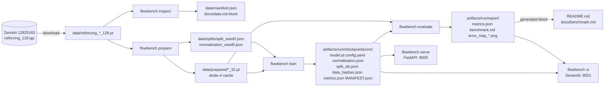

# Architecture

FlowBench is one installable package (`src/flowbench`) with one CLI. Each pipeline step
is a subcommand that takes `--config`; steps communicate only through files under
`data/` and `artifacts/` and through small typed objects (`FieldPairs`, `Split`,
`NormalizationStats`, `Predictor`, `LoadedCheckpoint`).

## Module map

| Module                    | Responsibility                                                            | Imports from            |
| ------------------------- | ------------------------------------------------------------------------- | ----------------------- |
| `flowbench.config`        | Typed YAML configuration (pydantic-settings); env vars override YAML      | pydantic, yaml          |
| `flowbench.logging`       | JSON-lines logging with keyword fields                                    | stdlib                  |
| `flowbench.cli`           | typer app; lazy-imports each step so `--help` stays fast                  | everything              |
| `flowbench.data.download` | Zenodo fetch via neuraloperator's helper (md5-checked), no-op if present  | neuralop                |
| `flowbench.data.inspect`  | Measures the archive; writes `data/manifest.json` and the docs block       | torch, requests         |
| `flowbench.data.split`    | Simulation detection, simulation-level split, hashes; `prepare` driver    | numpy, torch            |
| `flowbench.data.normalize`| Shared mean/std fitted on train only                                      | torch                   |
| `flowbench.data.dataset`  | Load through `NavierStokesDataset`, stride subsampling, cache, loaders     | torch, neuralop         |
| `flowbench.models.*`      | `Predictor` ABC, `Persistence`, `ConvNet`, registry with FNO slot         | torch                   |
| `flowbench.training.*`    | Seeding/device/determinism, trainer, checkpoint directory format          | torch, data, models     |
| `flowbench.evaluation.*`  | Pure metrics, latency, high-vorticity slice, report + generated docs      | torch, numpy, matplotlib|
| `flowbench.serving.*`     | `FieldPredictor` (pure), FastAPI app, schemas, structured errors          | fastapi                 |
| `flowbench.ui.*`          | Streamlit script (`app.py`), figure builders (`panels.py`), launcher      | streamlit, plotly, mpl  |

Rules enforced by structure:

- Only `serving/app.py`, `serving/errors.py` and `ui/app.py` import FastAPI or Streamlit.
- `evaluation/metrics.py` is pure Torch with no I/O; every metric is a per-sample
  tensor, aggregated in one place (`report.score`).
- `serving/predictor.py` imports neither FastAPI nor Streamlit. Evaluation times this
  exact object so the reported latency is the served path.
- No `print` in library code; the loader's own progress prints are captured.
- `ui/launch.py`, `ui/panels.py` and `ui/demo.py` are the additions to the prescribed
  layout: `ui/app.py` is executed by `streamlit run` and must not be imported by the CLI,
  so the launcher lives apart from it; the figure builders (2D matplotlib panels, Plotly
  3D surfaces, per-sample metrics) live in `panels.py` so they are unit-testable without
  running the page; `demo.py` exports and loads the self-contained `demo/` bundle used by
  the hosted viewer when `data/` and `artifacts/` are absent (see `docs/deploy.md`).

## Data flow

## Checkpoint contract

A checkpoint is a directory, never a pickle of a model class. `load_checkpoint`
rebuilds the model from `config.yaml` through the registry and loads `model.pt`
(a plain `state_dict`). Everything needed to re-evaluate is inside: normalisation
statistics, the split with data hashes, the training metrics and a `MANIFEST.json`
with git SHA, dirty flag, timestamp, device, package and torch versions, and the
determinism record. `tests/integration/test_evaluate_smoke.py` asserts that a reloaded
checkpoint reproduces `metrics.json` within `evaluation.metrics_tolerance`.

## Design decisions

Each entry names the alternative that was rejected.

1. **Working resolution 32×32 by stride-4 decimation of the 128 archive, done in
   FlowBench.** Zenodo ships 128 and 1024 only. The loader's `subsampling_rate` was
   tried first and strides only one axis for this archive, so `dataset.subsample`
   applies `[:, :, ::4, ::4]` and asserts the shape. Rejected: area averaging (adds an
   undocumented filter to the data).
2. **Split by detected simulation, which here is the instance.** `detect_simulations`
   chains `y[i] == x[i+1]`; the archive has no such links, so each instance is its own
   simulation and the manifest says so. Rejected: assuming trajectories from prior
   knowledge of similar datasets.
3. **Circular padding**, chosen from the measured wrap/interior jump ratio (~1.0) and
   exposed as `model.cnn.padding_mode`. Rejected: zero padding by default (would
   introduce an artificial boundary the data does not have).
4. **One shared normalisation for inputs and targets.** Keeps persistence an exact
   identity in both spaces; the 4.6× scale gap between `x` and `y` is left to the model.
   Rejected: separate input/output encoders (persistence would no longer be the identity
   in normalised space and the trainer would need model-specific handling).
5. **Residual CNN output.** `y = x + f(x)` so an untrained model starts at persistence.
   Rejected: direct prediction (slower start, no other benefit at this size).
6. **Latency measured through `FieldPredictor.predict`**, the same object the API
   calls, after warm-up with device synchronisation. Rejected: timing the bare forward
   pass (would exclude preprocessing the spec asks for).
7. **Docs numbers are generated.** `inspect` and `evaluate` rewrite marked blocks in
   `docs/*.md` and `README.md`; `run.update_docs: false` in the smoke config keeps
   smoke numbers out. Rejected: copying numbers by hand.
8. **Config over constants.** Every threshold (`relative_l2_epsilon`,
   `high_vorticity_quantile`, `trajectory_link_atol`, `periodicity_ratio_max`) is in
   YAML; smoke and default share one schema so CI exercises the real code path on
   synthetic fixtures.

## Extension point: FNO

`models/registry.py` maps a name to a `(ModelConfig) -> Predictor` builder. An FNO
would add an `fno` section to `ModelConfig`, one builder, and nothing else: training,
checkpointing, evaluation, serving and the UI all go through `build_model` and the
`Predictor` interface (normalised `(b, 1, 32, 32)` in, same shape out).
