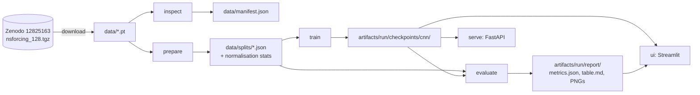

# Architecture

Written in Phase 0; expanded as each phase lands.

## Module map

| Module                  | Responsibility                                                    | May import          |
| ----------------------- | ----------------------------------------------------------------- | ------------------- |
| `flowbench.config`      | Typed YAML configuration (pydantic-settings)                      | pydantic, yaml      |
| `flowbench.logging`     | Structured JSON logging                                           | stdlib              |
| `flowbench.cli`         | typer app; one subcommand per pipeline step                       | everything          |
| `flowbench.data.*`      | Download, inspect, split, normalise, torch datasets               | torch, neuralop     |
| `flowbench.models.*`    | `Predictor` interface, persistence, CNN, registry                 | torch               |
| `flowbench.training.*`  | Trainer, checkpoint format, seeding                               | torch, data, models |
| `flowbench.evaluation.*`| Pure metrics, latency, slices, report                             | torch, numpy, mpl   |
| `flowbench.serving.*`   | FastAPI app, schemas, thin predictor wrapper, error bodies        | fastapi             |
| `flowbench.ui.*`        | Streamlit viewer (`app.py` is a script; `launch.py` spawns it)    | streamlit           |

Only `serving/` and `ui/` import FastAPI or Streamlit. `evaluation/metrics.py` is pure
NumPy/Torch with no I/O.

`ui/launch.py` is the one addition to the prescribed layout: `ui/app.py` is executed by
`streamlit run` and must not be imported by the CLI, so the subprocess launcher lives in
its own module.

## Data flow

## Design decisions

Recorded as they are made; each entry names the alternative that was rejected.

1. **Working resolution 32×32 by stride-4 subsampling of the 128×128 archive.** The Zenodo
   record ships 128 and 1024 only. Subsampling uses the loader's own `subsampling_rate`
   so the transformation is the library's, not ours. Alternative rejected: area
   averaging (would need custom code and diverge from how `neuraloperator` users see the data).
2. **Config first.** Every threshold, seed and path is in `configs/*.yaml`; the smoke and
   default configs share one schema so CI exercises the real code path.
